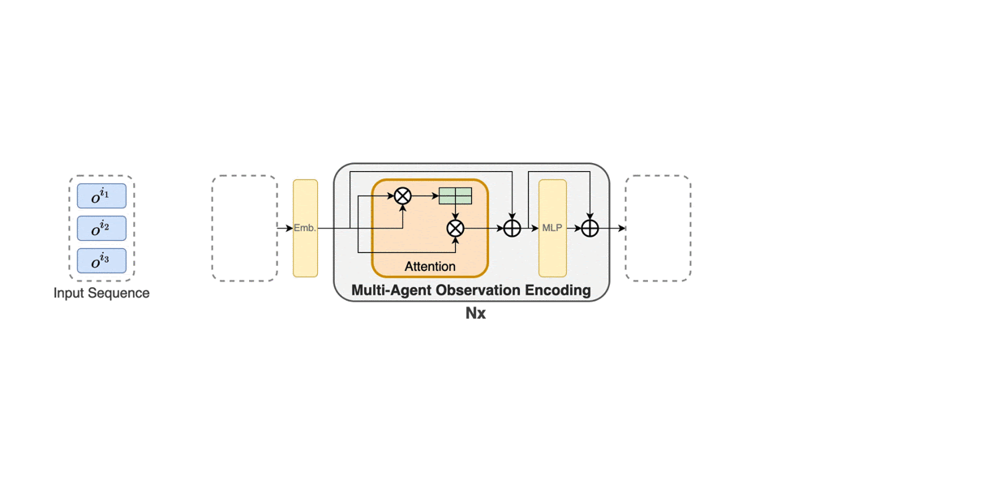

# Multi-Agent Transformer
This repository implements the Multi-Agent Transformer (MAT), which is a novel neural network based on the encoder-decoder architecture that implements a multi-agent learning process through sequence models. **For more details, welcome to our page site about Muti-Agent Transformer: https://sites.google.com/view/multi-agent-transformer .**

## Architecture and Dynamic data flow of MAT
||
|:-------------------------: |
|Architecture|    
 

||
|:-------------------------: |
|Dynamic data flow|    

## Installation

### Dependences
``` Bash
pip install -r requirements.txt
```

### Multi-agent MuJoCo
Following the instructios in https://github.com/openai/mujoco-py and https://github.com/schroederdewitt/multiagent_mujoco to setup a mujoco environment. In the end, remember to set the following environment variables:
``` Bash
LD_LIBRARY_PATH=${HOME}/.mujoco/mujoco200/bin;
LD_PRELOAD=/usr/lib/x86_64-linux-gnu/libGLEW.so
```

### StarCraft II & SMAC
Run the script
``` Bash
bash install_sc2.sh
```
Or you could install them manually to other path you like, just follow here: https://github.com/oxwhirl/smac.

### Google Research Football
Please following the instructios in https://github.com/google-research/football. 

### Bi-DexHands 
Please following the instructios in https://github.com/PKU-MARL/DexterousHands. 

## How to run
When your environment is ready, you could run shells in the "scripts" folder with algo="mat" or algo="mat_dec". For example:
``` Bash
./train_mujoco.sh  # run MAT/MAT-Dec on Multi-agent MuJoCo
```
If you would like to change the configs of experiments, you could modify sh files or look for config.py for more details.

## Demo
MAT consistently outperforms its rivals, indicating its modeling capability for homogeneous-agent tasks (agents are interchangeable).

Videos on four super-hard scenarios are shown below.

|||||
|:-----------: |:-------------------: |:-----------: |:----------: |
|27m vs 30m|MMM2|6h vs 8z|3s5z vs 3s6z|    

## Performance Comparisons on Cooperative MARL Benchmarks

Demonstration and Performance comparison on Multi-Agent Mujoco HalfCheetah and  Bimanual Dexterous Hands Manipulation tasks, showing MAT's advantages in robot control for heterogeneous agents (agents are not interchangeable).


Performance comparison on the Google Research Football tasks with 2-4 agents from left to right respectively, telling the same conclusion that MAT outperforms MAPPO and HAPPO.


## MAT as Excellent Few-short Learners

Few-shot performance comparison with models pre-trained on complete HalfCheetah. MAT exhibits powerful generalisation capability when parts of the robot fail.


Few-shot performance comparison with pre-trained models on multiple SMAC tasks. Sequence-modeling-based methods, MAT and MAT-Dec, enjoy superior performance over MAPPO, justifying their strong generalisation capability as few-shot learners.

