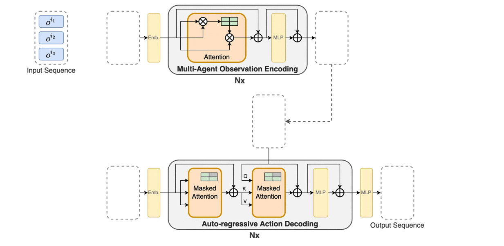
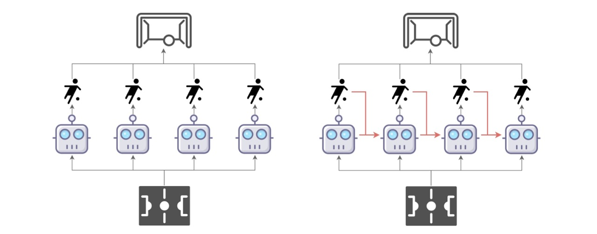
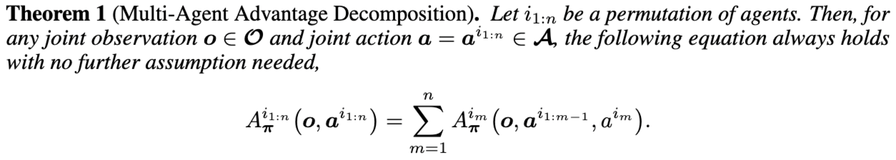
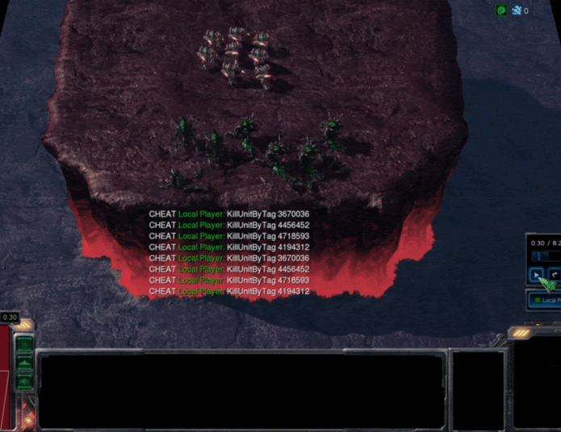
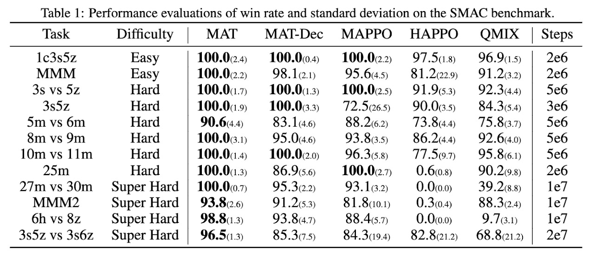
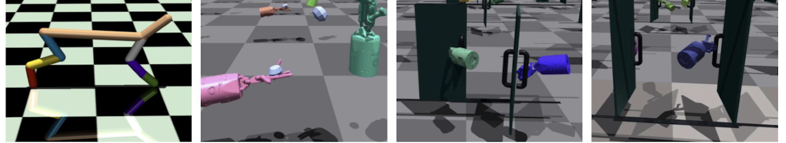
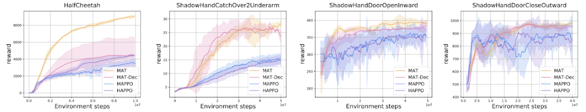
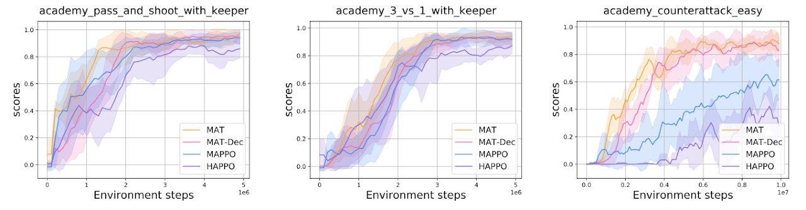
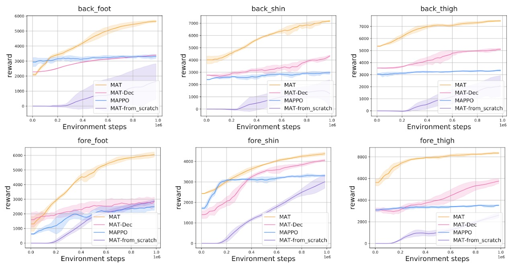
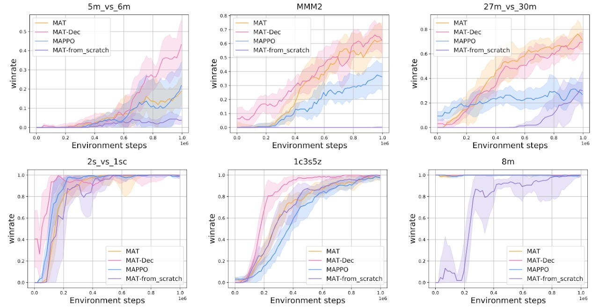

# Multi-Agent Transformer

This is the **official implementation** of MAT. MAT is a novel neural network based on the encoder-decoder architecture that implements a multi-agent learning process through sequence models, aiming to build the bridge between MARL and SM so that the modeling power of modern sequence models, the Transformer, can be unleashed for MARL. 

**For more details, please visit our page site about Muti-Agent Transformer: https://sites.google.com/view/multi-agent-transformer.**

In short, MAT:

* casts cooperative MARL into sequence modeling problems.

* is an encoder-decoder architecture building the bridge between MARL and the Transformer.

* is an online RL method trained by trails and errors, which is different from previous offline approaches, e.g. Decision Transformer or GATO (more like supervised learning). 

* leverages the multi-agent advantage decomposition theorem [Kuba et.al] to render only linear time complexity for multi-agent problems and ensure a monotonic performance improvement guarantee.

* achieves superior performance and generalisation capability on benchmarks including StarCraftII, Multi-Agent MuJoCo, Dexterous Hands Manipulation, and Google Research Football.

We present GIFs below to show the architecture and dynamic data flow of MAT.
||
|:-------------------------: |
|Architecture of MAT|    
 

## Installation

### Dependences
``` Bash
pip install -r requirements.txt
```

### Multi-agent MuJoCo
Following the instructios in https://github.com/openai/mujoco-py and https://github.com/schroederdewitt/multiagent_mujoco to setup a mujoco environment. In the end, remember to set the following environment variables:
``` Bash
LD_LIBRARY_PATH=${HOME}/.mujoco/mujoco200/bin;
LD_PRELOAD=/usr/lib/x86_64-linux-gnu/libGLEW.so
```

### StarCraft II & SMAC
Run the script
``` Bash
bash install_sc2.sh
```
Or you could install them manually to other path you like, just follow here: https://github.com/oxwhirl/smac.

### Google Research Football
Please following the instructios in https://github.com/google-research/football. 

### Bi-DexHands 
Please following the instructios in https://github.com/PKU-MARL/DexterousHands. 

## How to run
When your environment is ready, you could run shells in the "scripts" folder with algo="mat" or algo="mat_dec". For example:
``` Bash
./train_mujoco.sh  # run MAT/MAT-Dec on Multi-agent MuJoCo
```
If you would like to change the configs of experiments, you could modify sh files or look for config.py for more details.


## Multi-Agent Sequential Decision Paradigm

Conventional multi-agent learning paradigm (left) wherein all agents take actions simultaneously vs. the multi-agent sequential decision paradigm (right) where agents take actions by following a sequential order, each agent accounts for decisions from preceding agents as red arrows suggest. 



The key insight of the multi-agent sequential decision paradigm is the multi-agent advantage decomposition theorem (a discovery in [HATRPO/HAPPO](https://arxiv.org/abs/2109.11251) [ICLR 22, Kuba et.al], indicating the advantage of joint actions could be sequentially divided as shown below.



## Performance Comparisons on Cooperative MARL Benchmarks

MAT consistently outperforms its rivals, indicating its modeling capability for homogeneous-agent tasks (agents are interchangeable).

Videos on four super-hard scenarios are shown below.

|||||
|:-----------: |:-------------------: |:-----------: |:----------: |
|27m vs 30m|MMM2|6h vs 8z|3s5z vs 3s6z|    



Demonstration and Performance comparison on Multi-Agent Mujoco HalfCheetah and  Bimanual Dexterous Hands Manipulation tasks, showing MAT's advantages in robot control for heterogeneous agents (agents are not interchangeable).




Performance comparison on the Google Research Football tasks with 2-4 agents from left to right respectively, telling the same conclusion that MAT outperforms MAPPO and HAPPO.


## MAT as Excellent Few-short Learners

Few-shot performance comparison with models pre-trained on complete HalfCheetah. MAT exhibits powerful generalisation capability when parts of the robot fail.



Few-shot performance comparison with pre-trained models on multiple SMAC tasks. Sequence-modeling-based methods, MAT and MAT-Dec, enjoy superior performance over MAPPO, justifying their strong generalisation capability as few-shot learners.




## Citation
Please cite as following if you think this work is helpful for you:
```
@article{wen2022multi,
  title={Multi-Agent Reinforcement Learning is a Sequence Modeling Problem},
  author={Wen, Muning and Kuba, Jakub Grudzien and Lin, Runji and Zhang, Weinan and Wen, Ying and Wang, Jun and Yang, Yaodong},
  journal={arXiv preprint arXiv:2205.14953},
  year={2022}
}
```

